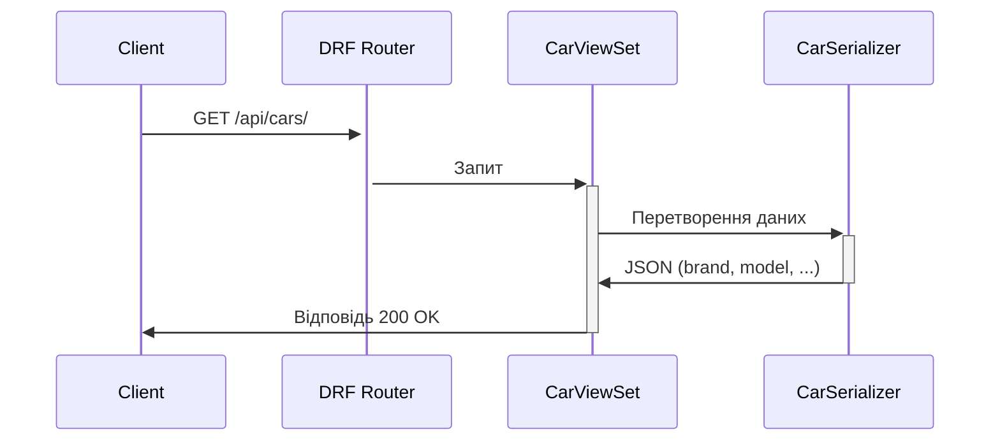

### **Core Django Modules**

| Модуль/Файл          | Призначення | Приклад Використання |
|-----------------------|------------|----------------------|
| `models.py`           | Визначає структуру БД (таблиці, поля, зв’язки). Кожен клас — це SQL-таблиця. | `class Car(models.Model): brand = models.CharField(max_length=50)` |
| `views.py`            | Обробляє HTTP-запити, повертає відповіді (HTML, JSON). | `def car_list(request): return JsonResponse({"cars": list(Car.objects.values())})` |
| `urls.py`             | Мапує URL-шляхи на view (роутинг). | `path('cars/', views.car_list, name='car-list')` |
| `settings.py`         | Глобальні налаштування проєкту (БД, інстальовані додатки, middleware). | `INSTALLED_APPS = ['rest_framework']` |
| `admin.py`            | Налаштовує адмін-панель Django. | `admin.site.register(Car)` |
| `serializers.py` (DRF)| Перетворює моделі Django у JSON (і навпаки), валідує дані. | `class CarSerializer(serializers.ModelSerializer): ...` |
| `migrations/`         | Зберігає історію змін моделей для синхронізації БД. | `python manage.py makemigrations` |
| `templates/`          | HTML-шаблони для відображення даних (у классичних Django-додатках). | `
{{ car.brand }}
` |
| `manage.py`           | CLI-утиліта для керування проєктом. | `python manage.py runserver` |

---

### **Django REST Framework (DRF) Modules**

| Модуль/Файл          | Призначення | Приклад Використання |
|-----------------------|------------|----------------------|
| `serializers.py`      | Визначає, які поля моделі конвертуються в JSON (серіалізація/десеріалізація). | `image_url = serializers.SerializerMethodField()` |
| `views.py` (API)      | Містить APIView, GenericView або ViewSet для обробки REST-запитів. | `class CarViewSet(viewsets.ModelViewSet): queryset = Car.objects.all()` |
| `routers.py` (DRF)    | Автоматично генерує URL-маршрути для ViewSet. | `router.register(r'cars', CarViewSet)` |
| `permissions.py`      | Контролює доступ до API (наприклад, тільки для аутентифікованих). | `permission_classes = [IsAuthenticated]` |
| `authentication.py`   | Визначає методи аутентифікації (Token, JWT, Session). | `authentication_classes = [TokenAuthentication]` |
| `pagination.py`       | Налаштовує пагінацію для списків (ліміт, offset). | `pagination_class = PageNumberPagination` |
| `filters.py`          | Фільтрація даних у API (по полям, діапазонам). | `filter_backends = [DjangoFilterBackend]` |

---

### **Додаткові модулі Django**

| Модуль               | Призначення |
|-----------------------|------------|
| `signals.py`          | Відправка/обробка подій (наприклад, після збереження моделі). |
| `middleware.py`       | Проміжне ПЗ для обробки запитів/відповідей (наприклад, CORS). |
| `context_processors.py` | Додає глобальні змінні до всіх шаблонів. |
| `utils/`              | Допоміжні функції (наприклад, кастомні поля моделей). |

---

### **Приклад зв’язків модулів (API Flow)**

1. **Клієнт** робить GET-запит на `/api/cars/`.  
2. **URL Router** (DRF) направляє запит у `CarViewSet`.  
3. **ViewSet** використовує `CarSerializer` для перетворення даних з БД у JSON.  
4. **Serializer** вибирає поля з моделі `Car` (ігнорує `created_at`).  
5. **ViewSet** повертає JSON-відповідь клієнту.  

---

### **Ключові відмінності Django vs DRF**

| Модуль Django        | Відповідник у DRF       | Різниця |
|-----------------------|-------------------------|---------|
| `View` (HTML)         | `APIView`               | DRF повертає JSON, Django — HTML. |
| `Form`                | `Serializer`            | Serializer працює з JSON, Form — з HTML-формами. |
| `TemplateView`        | Немає (використовуйте `Response`) | DRF не використовує шаблони. |

---

Ця таблиця допоможе швидко зорієнтуватися у призначенні кожного компонента Django/DRF. Для глибшого вивчення дивіться [офіційну документацію](https://docs.djangoproject.com/).
